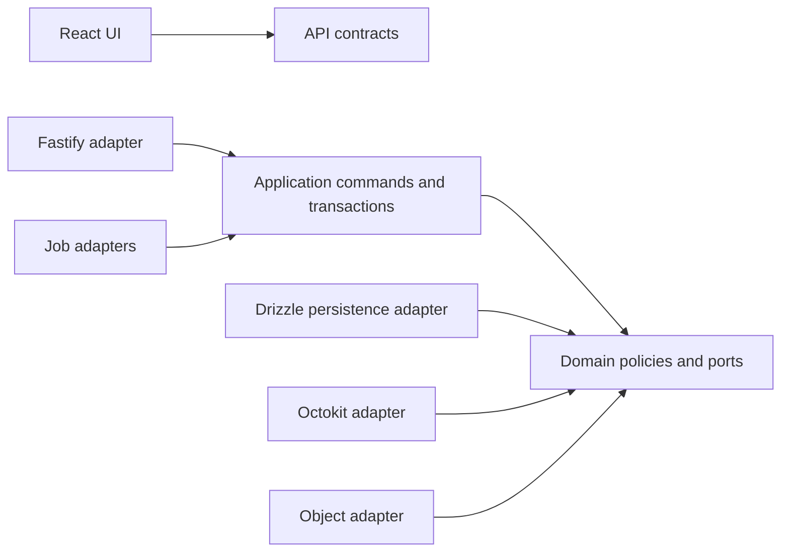

# Architecture spine

## Authority and paradigm

DECISION AD-1–AD-11 preserve Juan's approvals in the append-only `.memlog.md`; AD-10 and AD-11 were recorded in one entry but are distinct identifiers. AD-12–AD-18 already appeared as proposed ADR references in ARCHITECTURE.md and are now consolidated below without renumbering. They remain RECOMMENDATION, not approved decisions. No further AD number is allocated in this consolidation.

Modular monolith, ports/adapters at integration boundaries, one repository and shared domain. API and worker deploy independently; integration, preservation and retention profiles are worker configurations, not microservices. Domain owns academic truth; GitHub owns hosted Git state; object storage owns preserved bytes with authoritative metadata in PostgreSQL.

Arrows show allowed source dependencies. Domain imports none of the outer adapters. Application orchestrates shared transactions through ports, rather than duplicating domain rules in HTTP and jobs.

## Invariants and decisions

### AD-1 — Formative assessment [ADOPTED]
- **Binds:** Actions, evaluation, grading, future evaluator.
- **Prevents:** external test results becoming official grades without academic authority.
- **Rule:** Separate automatic results, academic evaluation, draft and published grade. Every automatic result identifies evaluated SHA. Only explicit teacher publication is authoritative in MVP. Future authoritative grading requires protected execution/scoring and verifiable provenance independent of student-controlled code, never a trust flag on a formative report.

### AD-2 — Explicit revision submission [ADOPTED]
- **Binds:** Git activity, acceptance, submissions and UX.
- **Prevents:** pushes silently replacing delivered evidence.
- **Rule:** Explicit Submit records a SHA-specific revision; allow new revisions, mark lateness and never use Git hard cutoff in MVP. Activity and delivered revision are separate references.

### AD-3 — Teacher-confirmed identity [ADOPTED]
- **Binds:** identity, roster, authorization and corrections.
- **Prevents:** known identifiers/invitations or GitHub organization membership granting academic identity.
- **Rule:** Request follows GitHub login; authorized teacher approves/rejects. At most one active binding per institutional academic identity. Preserve user/profile/account/institution association and request/binding/revocation/replacement history. Corrections are teacher-authorized and audited, never silent overwrite. Future institutional verifiers extend proof, not academic authority.

### AD-4 — Revision-specific evaluation [ADOPTED]
- **Binds:** submissions, evaluations, drafts, publications.
- **Prevents:** resubmission inheriting grades or invalidating earlier evaluation.
- **Rule:** Evaluation and draft keep exact Submission revision. New revision is visible but creates no evaluation or grade automatically. Teacher creates new evaluation/draft and explicitly publishes replacement. Existing publication remains current until replacement or AD-9 withdrawal. Prior publication evidence stays permanently in audit; normal deadlines remain applicable.

### AD-5 — Durable receipt and academic time [ADOPTED]
- **Binds:** intake, validation, deadlines, exceptions and UX.
- **Prevents:** fabricated receipts, backdating and processing delay determining lateness.
- **Rule:** Persist actor, acceptance/assignment, SHA, backend UTC received time, effective deadline and policy version before receipt acknowledgement. Receipt at or before deadline is candidate on-time; confirm only valid authorization and revision evidence. Insufficient evidence needs review; invalid requests never confirm. Separate validation from classification. Teacher exceptions and later reclassification append decisions without changing receipt. Same-key retry returns original operation; changed SHA is a new operation.

### AD-6 — Exact-SHA preservation [ADOPTED]
- **Binds:** confirmed revisions, capture and storage.
- **Prevents:** current-branch substitution, preservation failure altering academic truth.
- **Rule:** Every confirmed revision creates a private capture operation, not every push. No full Git mirror. Bytes live outside PostgreSQL; DB stores revision/SHA/object reference/digest/size/time/state/origin/mechanism/completeness. Failures are visible and retryable independently of confirmation. No archived content executes in API/preservation worker. Capture after receipt proves content preserved, not prior availability. Authorize access and audit exceptional/admin access.

### AD-7 — Pilot retention and configurable limits [ADOPTED]
- **Binds:** closure, publication, capture, holds, purge, restore and telemetry.
- **Prevents:** permanent code retention by implication, silent shortening or premature deletion.
- **Rule:** Active/unclosed course retains snapshots; archive is not academic_close. Retain 12 months after explicit close; later publication extends referenced evidence at least 12 months. Expiry begins 30-day pending deletion; authorized hold records reason/responsible/creation/review, never auto-released on review date. Version policy; migrate existing promises explicitly and audit. Preserve minimal metadata permanently after byte deletion. Verify recoverable provider copies gone; extra 30-day backup bound remains RESEARCH REQUIRED. Restore replays deletion records. Initial configurable limits: 100 MiB compressed, 500 MiB expanded, 20,000 entries, 20 GiB/course, 100 GiB/institution, 80/95% alerts. Block preservation without truncation/early deletion or infinite deterministic retries; forecast and measure usage, percentiles, durations, growth and blocked/failure frequency.

### AD-8 — Exact numeric scale [ADOPTED]
- **Binds:** assignment versions, evaluation, draft and publication.
- **Prevents:** rounding input, absent-to-zero conversion and reinterpretation of history.
- **Rule:** Positive per-version maximum, exact decimals up to two places, score between zero and maximum inclusive. Reject excess precision. Publish score/max/configuration/evaluation/revision/actor/time as immutable evidence. Later scale changes are explicit/versioned/audited without automatic mass regrading. Percentage is derived only and half-up rounded to at most two decimals. Extra credit, letters, implicit conversions and weighted course averages are outside MVP.

### AD-9 — Explicit withdrawal [ADOPTED]
- **Binds:** current grade, immutable events, concurrency and student visibility.
- **Prevents:** withdrawing a concurrent replacement or restoring an old grade accidentally.
- **Rule:** Authorized teacher explicitly withdraws exactly current publication with reason, immutable event and idempotency. Compare expected current publication atomically. No current grade afterward; no zero, fallback, draft/evaluation/submission mutation or retention shortening. New publication required even for same value. Separate student-safe reason/internal notes; preserve full permanent event sequence.

### AD-10 — Dedicated pilot organization [ADOPTED]
- **Binds:** tenancy, installation ownership and pilot preparation.
- **Prevents:** personal/shared org policy leakage and cross-tenant data mixing.
- **Rule:** One pilot institution and dedicated controlled GitHub org, institutional owner; name/existence can be preparation prerequisite. Validate administration/install authority, members/outside collaborators/base access/private creation/Actions/third-party policies/limits/security/deletion/transfer/webhooks. Future institutions connect distinct orgs without changing domain isolation. GitHub membership is not academic authorization.

### AD-11 — Base stack and processes [ADOPTED]
- **Binds:** physical architecture and dependencies.
- **Prevents:** unrequested microservices/brokers or HTTP-bound async work.
- **Rule:** TypeScript, React/Vite, Fastify, PostgreSQL, Drizzle, Octokit adapters, pg-boss, private objects, Vitest, Playwright, Docker. Modular monolith with separate API/worker processes. No Redis/microservices absent measured need or unmet requirement. Verify versions, peers, maintenance, deployment, queue/migrations, storage and integration before implementation. Base-stack approval is not implementation authorization.

### AD-12 — Tenant ownership [PROPOSED]
- **Binds:** DB, API, workers, cache, exports and evidence.
- **Prevents:** individually compliant modules referencing another tenant's records.
- **Rule:** Tenant entities use `(institution_id,id)` keys and composite FKs, forced RLS and transaction-local tenant/actor context under non-owner runtime roles. Same-tenant cross-course relationships require additional ownership constraints. Resolve tenant from trusted resource/installation mapping; role never grants implicit global academic read.

### AD-13 — Durable effect protocol [PROPOSED]
- **Binds:** outbox, inbox, queue, workers and provider calls.
- **Prevents:** lost intent or duplicate external business effects after crashes.
- **Rule:** Atomic domain/audit/outbox commit; at-least-once dispatcher and idempotent effect keys/checkpoints. Raw authenticated webhook envelope precedes acknowledgement. No DB transaction spans slow provider calls. Unknown external outcome reconciles provenance before retry. Domain evidence outlives queue retention; runtime pg-boss migration disabled and release job owns schema changes.

### AD-14 — Evidence provenance and states [PROPOSED]
- **Binds:** previews, validation, Actions and student projections.
- **Prevents:** a later observation proving an earlier fact or a run for one SHA grading another.
- **Rule:** Receipt, validation, classification, revision, capture and grade lifecycle are independent. Server-bound preview observation fixes actor/acceptance/repo/SHA/branch/policy and observed time. Missing admissible pre-receipt evidence needs review. Preserve run/attempt/workflow/SHA/report provenance; no reporting data can write official grades. Preview TTL/eligibility semantics are R-01 in EVIDENCE, not user approval.

### AD-15 — Publication and purge serialization [PROPOSED]
- **Binds:** drafts, current pointer, withdrawal, retention and purge.
- **Prevents:** publication overwrites or deletion racing newly extended retention.
- **Rule:** Immutable events with current pointer/generation CAS and draft version; atomically extend retention when publishing. Snapshot lock/deletion fence serializes hold/publication against purge. After destructive fence, competing preservation demand returns explicit conflict. Tombstone reaches independent journal before bytes are deleted; restore gates access on replay.

### AD-16 — Private bounded evidence [PROPOSED]
- **Binds:** capture, quota, download and deletion.
- **Prevents:** archive abuse, quota races and unauthorized source downloads.
- **Rule:** Reserve institution then course capacity, stream/inspect bounded archives without execution, commit exact-SHA metadata only after integrity verification. Capture attempts use generation fencing. Authenticated authorized download uses opaque snapshot ID, never caller object key. Purge verifies all recoverable versions/copies, never timer-only success. AWS S3 is a provider recommendation, not an approved vendor.

### AD-17 — Stable templates [PROPOSED]
- **Binds:** published assignment versions and provisioning.
- **Prevents:** accepting students receiving different starter content silently.
- **Rule:** Record template repo/commit/tree; require dedicated frozen template version; verify before generation and compare generated content before granting access. GitHub generate cannot be assumed to accept arbitrary SHA. Drift quarantines, never silently changes version. Sandbox proof is required before implementing this integration.

### AD-18 — Audited identity lineage [PROPOSED]
- **Binds:** institution-wide bindings, courses, submissions and external access.
- **Prevents:** single-course correction granting cross-course authority or reassigning historical authorship.
- **Rule:** Correction requires teacher authority for all affected courses or explicit scoped institutional grant; reverse uniqueness is proposed. Record predecessor/successor, invalidate old authorization and reconcile GitHub access by generation. Existing acceptance subject stays academic-profile based; future actions use current authorized binding and preserve the actual actor/binding on each new request. Never rewrite historical receipt/grade identity.

## Stack seed

Exact candidate pins are RECOMMENDATION from documentary research, not an installed/validated lockfile. Full matrix, sources, conservative alternatives and outstanding peer/DDL tests are in EVIDENCE.md and reviews/STACK-RESEARCH.md. Selected Node 24 LTS, PostgreSQL 18 and TypeScript 6 avoid unsupported prereleases and unproven TS7 tooling migration. Changing a patch does not rewrite an AD; changing the approved stack requires rationale and approval where material.

## Consistency conventions

| Concern | Contract |
| --- | --- |
| IDs | UUID API/local IDs; GitHub bigint IDs encoded as decimal strings |
| Decimal | String in JSON; exact numeric DB; no percent storage |
| Time | UTC timestamps; nullable deadline means not_applicable; immutable receipt policy |
| API | `/api/v1`, snake_case fields, error envelope, cursor pagination; OpenAPI is route/schema authority |
| States | Canonical labels in STATE-MACHINES and OpenAPI; no arbitrary state mutation |
| Events/jobs | Versioned operation references in OPERATIONS, no credentials in payload |
| Evidence | Different rows for requests, confirmed submissions, evaluations and publications |
| Scope | Individual MVP; groups/rubrics V1; LMS/authoritative grading later |

## Deferred and review gates

EVIDENCE.md owns open-item identifiers, owner and closure gate. Remaining external choices are hosting/storage region and institutional readiness; remaining experiments concern compatibility, GitHub permissions/templates, temporal evidence and recoverable-copy deletion. Concrete proposed defaults cover subordinate design choices so builders cannot invent contradictory defaults. They require independent review and package approval before building. REVIEW.md records preparation checks; it does not claim the independent adversarial gate has passed.

