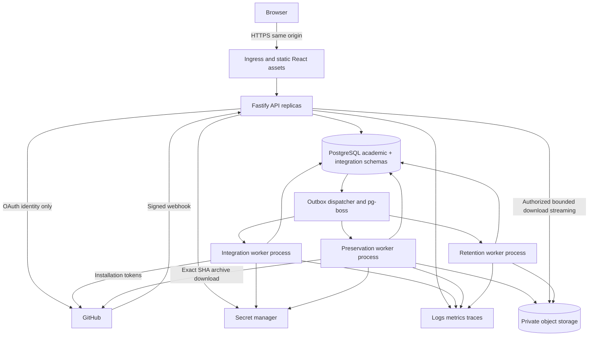

# Physical architecture and ADR rationale

## Deployment shape — RECOMMENDATION



AD-11 mandates separate API and worker deployables. Integration, preservation and retention are worker profiles using the same repository/image and domain packages, not microservices. Separate profiles have distinct credentials. A pilot may colocate them on the same container host but never in the HTTP process. Jobs survive HTTP deployment. No student code runs in these profiles.

Production candidate: managed PostgreSQL and a container platform that supports continuously running workers, private networking and workload identities. AWS S3 is the concrete proposed object provider; compute provider and region remain a deployment gate, not a missing domain interface. See EVIDENCE for comparison and unverified provider guarantees. A request-only/serverless host that cannot run pg-boss workers is unsuitable without a separate worker host.

Same-origin `/api/v1` avoids unnecessary cross-origin cookies. API accepts JSON and bounded CSV imports; GitHub webhook route preserves raw bytes. Browser never receives GitHub credentials. Static assets can use CDN caching; authenticated academic responses use private/no-store caching unless a specific scoped cache policy is proven safe.

## Module ownership and dependencies

| Module | Owns | May call |
| --- | --- | --- |
| Identity | Local user/account/session, identity requests/bindings | Authorization policies, provider identity adapter |
| Courses | Institution, staff membership, roster, course closure | Identity read contracts |
| Assignments | Versions, invitations, extensions, acceptances | Course authorization, integration command port |
| Submissions | Requests, receipts, eligibility evidence, revisions, academic resolutions | Assignment policies, repository observation port |
| Assessment | Evaluations, drafts, publications, withdrawals, current-grade pointer | Submission read contracts; retention policy transaction |
| Integration | Org/install bindings, repository observations, Actions, webhook inbox | GitHub adapter; narrow domain command ports |
| Preservation | Snapshots, capture attempts, quota reservations, holds, purge ledger | Object storage adapter; exact-SHA archive adapter |
| Platform | Audit, idempotency, outbox, telemetry, configuration | No domain decisions |

Domain modules do not import Fastify, React, Octokit, pg-boss or object SDKs. Application handlers own transaction boundaries. Adapters implement domain ports. Do not expose a generic GitHub proxy API or allow frontend-supplied storage keys. A shared SQL transaction may span assessment/retention when publication extends retention; module ownership does not prohibit required atomicity.

## Physical persistence and identities

PostgreSQL schemas: `academic`, `integration`, `platform`, `pgboss`. `academic`/integration tenant tables use tenant-scoped FK pairs and forced RLS. Global account/session and inbound-installation routing tables are exceptions with explicit server-only access. Domain code cannot switch database roles from user input.

DB logins: `migration_owner` (DDL, not runtime); `api_runtime` (academic commands under tenant/user context); `integration_runtime` (integration observations and restricted domain functions, no grade-table writes); `preservation_runtime` (capture/quota metadata, no grades); `retention_runtime` (purge execution and tombstones, no grade edits); `queue_runtime` (pg-boss schema only). Runtime users are not table owners, superusers or BYPASSRLS. Security-definer routines, if used, have fixed search_path, no dynamic SQL and narrowly granted EXECUTE. They verify tenant/command scope; worker role possession is not blanket authority.

An API compromise remains a serious risk because it executes authorized academic writes; RLS is defense against isolation mistakes, not a guarantee against a fully compromised privileged application. Admin break-glass access requires a scoped grant and audit, never a universal frontend role bypass.

## Structural seed

```text
apps/
  web/                 React/Vite SPA, role-aware routes
  api/                 Fastify composition, OAuth, OpenAPI adapters
  worker/              worker profiles, dispatcher and schedulers
packages/
  domain/              policies, values and state transitions
  application/         commands, queries, transaction coordination
  contracts/           generated client types from reviewed OpenAPI
  database/            Drizzle schema and reviewed migrations
  github/              Octokit auth/repos/Actions/webhook adapters
  storage/             private object capture/read/purge adapters
  observability/       redacted logging and metrics
  test-support/        fixtures, provider stubs, builders
docs/                  approved package copied/adopted at implementation
```

This is a design tree, not generated application code. Prefer Vite's official React TypeScript starter for `apps/web`, with exact reviewed release pinned. Keep API/worker composition small instead of importing a SaaS starter with competing identity/ORM/billing decisions. npm workspaces and one committed lockfile are proposed; no task-graph framework is needed initially.

## ADR rationale (decisions live in the spine)

| ADR | Alternatives and trade-off | Result/status |
| --- | --- | --- |
| AD-1 | Formative Actions vs independent authoritative evaluator; speed vs trust engineering | Formative approved; future independent evaluator |
| AD-2/5 | Push-based vs explicit receipt; fewer clicks vs reproducible intent/time | Explicit SHA receipt approved |
| AD-3 | Teacher confirmation vs institutional integration | Teacher approval approved; provider-neutral verification metadata |
| AD-4/8/9 | Mutable grade vs immutable publications | Immutable records/current pointer approved, more records but auditability |
| AD-6/7 | References only/full mirror/per-revision snapshot | Per-revision approved; private object storage and bounded retention |
| AD-10 | Shared/personal org vs dedicated | Dedicated pilot org approved |
| AD-11 | Microservices/Redis vs modular monolith/PG queue | Approved shared domain and separate worker processes |
| AD-12 | Application filters alone vs tenant FK + RLS | Proposed both; more schema discipline, fewer cross-tenant mistakes |
| AD-13 | Redis publication vs outbox+PG queue | Proposed outbox; at-least-once delivery with durable effects |
| AD-14 | Trust webhook chronology vs independent observations | Proposed evidence provenance; ambiguity goes to teacher review |
| AD-15 | Generic publication status vs immutable withdrawal and pointer | Proposed CAS transaction; preserves adopted concurrency behavior |
| AD-16 | Stateless signed links vs authorized streaming | Proposed authenticated streaming for snapshots; API bandwidth cost, immediate auth check |
| AD-17 | Mutable templates vs published capture/version check | Proposed frozen template reference and post-generation verification; GitHub sandbox gate |
| AD-18 | Silent identity reassignment vs audited lineage+external reconciliation | Proposed institution-safe teacher correction; more explicit recovery |

Subordinate proposals do not reopen adopted business rules. Documentary candidate patches are recorded in EVIDENCE; no lockfile, full peer resolution or runtime compatibility has been verified.
