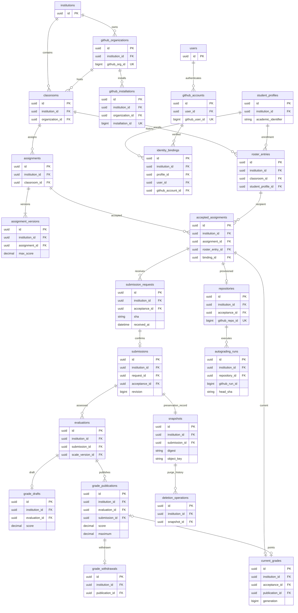
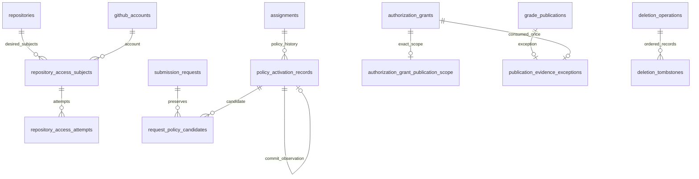

# Physical data model — design, not migrations

Physical mechanics remain RECOMMENDATION implementing AD-1–AD-11; Juan authorized bounded documentary repairs on 2026-09-17 without adopting AD-12–18. PostgreSQL is approved. No DDL has been applied.

## Type and key conventions

- Each table below has `id uuid PK`; tenant tables additionally have `institution_id uuid NOT NULL FK institutions.id` and `UNIQUE(institution_id,id)`. Every tenant-to-tenant FK is composite `(institution_id, referenced_id)` to that pair. This is required even when UUID collisions are improbable.
- `T` in the table catalog means the tenant conventions apply; `G` is a restricted global table. `FK table` means NOT NULL unless `?` is shown. In addition to tenant FK, relational ownership checks below require course/assignment/acceptance consistency.
- All times are `timestamptz` in UTC; lifecycle enums are database CHECK constraints on `text`, versioned by migration. `created_at` is mandatory for every record; mutable records have `updated_at` and `row_version bigint`.
- GitHub IDs are PostgreSQL `bigint` and API decimal strings (never JS Number). SHA is lowercase hex `text` with algorithm tag; MVP GitHub SHA-1 accepts exactly 40 characters. Cryptographic snapshot digest is SHA-256, not a replacement for Git SHA.
- Grade values use `numeric(12,2)` (proposed cap 9,999,999,999.99), verified precision in application before casting. API uses decimal strings. Reject third decimal even when zero; no silent SQL numeric rounding. Percentage is not persisted.
- All user-input lengths and API decimal caps are explicit in OpenAPI. JSONB is only bounded metadata, manifests and provider snapshots, never canonical relationships, roles, scores or lifecycle state.
- Logical/API mapping: AcademicIdentityBinding = identity_bindings; SubmissionReceipt preserves the original intake acknowledgement; SubmissionRequestStatus projects current submission_requests and its mutable row_version; Submission is only the confirmed submissions row. API maximum maps to assignment_versions.max_score; snapshot capture_state maps to snapshots.state; deletion_state projects the current deletion operation; TestRun.sha maps to head_sha. Immutable API records expose row_version=1 as a projection constant, never a mutable evidence field.
- DELETE RESTRICT for academic evidence/history. Tombstone records replace user-facing deletion; no cascading deletion of submissions, publications or audits. Permanent publication metadata is AD-4/7/9. Other PII retention is an institutional gate.

## Tables, columns and ownership

| Table | Scope | Required columns beyond common conventions; nullable marked ? | Keys and constraints |
| --- | --- | --- | --- |
| institutions | G | name text, status text, default_timezone text | Platform UUID; no tenant hierarchy in MVP |
| users | G | status text, display_name text | Active/suspended; not itself an academic role |
| github_accounts | G | user_id FK users, github_user_id bigint, login text, avatar_url? text, status text | U github_user_id; partial U user_id WHERE active; old accounts retained for lineage |
| auth_credentials | G | account_id FK github_accounts, ciphertext bytea, key_version text, expires_at, refresh_expires_at?, revoked_at? | U account_id; secret role only; no plaintext |
| sessions | G | user_id FK users, token_hash bytea, expires_at, revoked_at?, auth_generation bigint | U token_hash; session token never in logs |
| oauth_transactions | G | state_hash bytea, browser_binding_hash bytea, verifier_ciphertext bytea, expires_at, consumed_at?, user_id? FK users | U state_hash; single-use browser-bound callback |
| institution_memberships | T | user_id FK users, role text, status text | U institution,user; role admin/member; no implied course teacher |
| authorization_grants | T | subject_user_id FK users, issuer_user_id FK users, purpose text, capabilities text[], expires_at timestamptz, revoked_at? timestamptz | Allowlisted scoped support/correction capabilities; cannot delegate teacher publication to nonteacher |
| authorization_grant_courses | T | grant_id FK authorization_grants, classroom_id FK classrooms | U grant,classroom; normalized resource scope |
| github_organizations | T | github_org_id bigint, login text, status text | Global U github_org_id for active association; cannot belong to two tenants |
| github_installations | T | organization_id FK github_organizations, app_id bigint, installation_id bigint, status text, selection text, permissions jsonb, observed_at | U app_id,installation_id; one active installation/org/app |
| installation_routes | G | app_id bigint, installation_id bigint, institution_id FK institutions, installation_id_local uuid | U app_id,installation_id; restricted verified routing only; FK pair to tenant installation |
| classrooms | T | organization_id FK github_organizations, name text, slug text, timezone text, academic_period text, status text, academic_closed_at?, retention_generation bigint, retention_recalculation_pending bool | U institution,slug; draft/active/archived is separate from closure |
| classroom_memberships | T | classroom_id FK classrooms, user_id FK users, role text, capabilities text[], status text | U classroom,user; teacher/ta; capability allowlist only |
| student_profiles | T | academic_identifier text, name text, email? text, status text | U institution,normalized identifier; no public enumeration |
| roster_entries | T | classroom_id FK classrooms, student_profile_id FK student_profiles, status text | U classroom,profile; withdrawn row retained |
| identity_link_requests | T | profile_id? FK student_profiles, requested_identifier_ciphertext bytea, requested_identifier_hash text, requester_user_id FK users, github_account_id FK github_accounts, classroom_id FK classrooms, status text, decided_by? FK users, decided_at?, reason? | Non-enumerating intake also persists unmatched request; approval requires non-null matched profile. Partial U institution,classroom,requester,identifier_hash WHERE pending |
| identity_bindings | T | profile_id FK student_profiles, user_id FK users, github_account_id FK github_accounts, request_id? FK identity_link_requests, status text, verification_method text, approved_by FK users, ended_at?, predecessor_id? FK identity_bindings | Partial U institution,profile WHERE active; proposed reverse U institution,user and institution,account WHERE active |
| identity_binding_events | T | binding_id FK identity_bindings, actor_id FK users, action text, reason text, prior_binding_id? FK identity_bindings | Append-only approve/revoke/replace; identity history cannot retarget evidence |
| assignments | T | classroom_id FK classrooms, slug text, status text, current_version_id? FK assignment_versions | U classroom,slug; individual only in MVP |
| assignment_versions | T | assignment_id FK assignments, version int, title text, description text, max_score numeric(12,2), deadline? timestamptz, timezone text, branch text, template_repo_id bigint, template_sha text, template_tree_sha text, workflow_path text, report_schema_version text, grading_config jsonb, published_at?, published_by? FK users | U assignment,version; max>0; published version immutable; private visibility. Template defines workflow path; actual workflow ID is repo-specific |
| assignment_invitations | T | assignment_id FK assignments, token_hash bytea, expires_at?, disabled_at?, created_by FK users | U token_hash; rotation disables prior token in transaction |
| accepted_assignments | T | assignment_id FK assignments, roster_entry_id FK roster_entries, binding_id FK identity_bindings, accepted_at, acceptance_version_id FK assignment_versions, next_request_sequence bigint | U assignment,roster; immutable accepting binding; assignment/course matches roster |
| assignment_extensions | T | acceptance_id FK accepted_assignments, policy_version bigint, new_deadline timestamptz, reason text, granted_by FK users, supersedes_id? FK assignment_extensions | U acceptance,policy_version; current effective policy reference explicit; append-only |
| repositories | T | acceptance_id FK accepted_assignments, organization_id FK github_organizations, installation_id FK github_installations, github_repo_id? bigint, reserved_name text, observed_name? text, url? text, provisioning_state text, access_state text, sync_state text, last_observed_at? | U acceptance; U github_repo_id non-null; U organization_id,reserved_name; organization matches course/installation |
| provisioning_steps | T | repository_id FK repositories, operation_key text, step text, state text, attempt int, provider_request_id?, outcome jsonb | U repository,step,attempt; evidence of creation vs uncertain outcome |
| repository_observations | T | repository_id FK repositories, sha text, branch text, observed_at, source text, source_ref text, eligibility text | Append-only; fetched current snapshot differs from receipt-time evidence |
| submission_previews | T | acceptance_id FK accepted_assignments, observation_id FK repository_observations, actor_id FK users, binding_id FK identity_bindings, assignment_version_id FK assignment_versions, expires_at timestamptz | Server-bound preview; observation repo/branch/SHA and actor/binding must match |
| submission_requests | T | acceptance_id FK accepted_assignments, actor_id FK users, binding_id FK identity_bindings, sha text, branch text, request_sequence bigint, received_at, persistence_recorded_at, timestamp_source text, timestamp_instance text, clock_status text, clock_uncertainty_ms? bigint, timestamp_context_id text, deadline_status text, policy_resolution_state text, effective_deadline?, assignment_version_id FK assignment_versions, extension_id? FK assignment_extensions, policy_version text, validation_state text, idempotency_record_id FK idempotency_records | U idempotency record; U acceptance,request_sequence; immutable receipt columns; separate validation outcomes |
| submission_validations | T | request_id FK submission_requests, attempt int, authorized bool, evidence_ids jsonb, result text, validated_at, reason_code text | U request,attempt; evidence IDs resolve observations; no source-code payload |
| submissions | T | request_id FK submission_requests, acceptance_id FK accepted_assignments, revision bigint, confirmed_at, sha text, assignment_version_id FK assignment_versions | U request; U acceptance,revision; immutable exact request SHA and revision=request.request_sequence; create only on confirm |
| academic_incidents | T | classroom_id FK classrooms, student_profile_id FK student_profiles, assignment_id FK assignments, reported_by FK users, reported_at timestamptz, description text, state text | Outage evidence without receipt; reported_at is never received_at |
| academic_resolutions | T | request_id? FK submission_requests, incident_id? FK academic_incidents, actor_id FK users, decision text, resulting_request_version? bigint, classification text, reason text, evidence_ref? text, supersedes_id? FK academic_resolutions | Exactly one request/incident FK non-null; append-only; incident alone creates no confirmed submission; exception cannot authorize wrong identity/SHA |
| autograding_runs | T | repository_id FK repositories, github_run_id bigint, attempt int, workflow_id bigint, head_sha text, provider_state text, conclusion? text, report_state text, config_version_id FK assignment_versions, started_at?, completed_at? | U repository,run,attempt; config association derived/validated by platform, not trusted report assertion |
| autograding_results | T | run_id FK autograding_runs, test_key text, outcome text, score? numeric(12,2), maximum? numeric(12,2), duration_ms? bigint, report_digest text | U run,test_key; formative values only; invalid report recorded separately |
| evaluations | T | submission_id FK submissions, evaluator_id FK users, state text, scale_version_id FK assignment_versions | Fixed submission/scale; multiple evaluations permitted, none auto-created by resubmit |
| evaluation_evidence | T | evaluation_id FK evaluations, run_id FK autograding_runs, added_by FK users | U evaluation,run; repo/SHA must match evaluated submission |
| grade_drafts | T | evaluation_id FK evaluations, score? numeric(12,2), maximum numeric(12,2), feedback? text, internal_notes? text, author_id FK users | U evaluation; score null or valid; max/version inherited immutable |
| grade_publications | T | acceptance_id FK accepted_assignments, evaluation_id FK evaluations, submission_id FK submissions, score numeric(12,2), maximum numeric(12,2), scale_version_id FK assignment_versions, feedback text, publisher_id FK users, published_at, draft_version bigint, idempotency_record_id FK idempotency_records | U idempotency record; append-only; same acceptance/evaluation/submission; 0<=score<=maximum; public feedback snapshot |
| grade_withdrawals | T | publication_id FK grade_publications, teacher_id FK users, withdrawn_at, student_reason text, internal_notes? text, idempotency_record_id FK idempotency_records | U publication; append-only |
| current_grades | T | acceptance_id FK accepted_assignments, publication_id? FK grade_publications, generation bigint | U acceptance; CAS expected publication and generation; nullable after withdrawal |
| retention_policies | T | version int, close_months int, pending_days int, configuration jsonb, applied_at | U institution,version; values 12/30 pilot, immutable versions |
| quota_policies | T | version int, compressed_limit bigint, expanded_limit bigint, entries_limit int, course_limit bigint, institution_limit bigint | U institution,version; configurable approved initial values |
| snapshots | T | submission_id FK submissions, sha text, state text, object_key? text, object_version? text, digest? text, size_bytes? bigint, captured_at?, capture_version text, origin text, completeness_manifest jsonb, retain_until?, retention_policy_id FK retention_policies | U submission; one logical evidence object/revision; bytes separate from metadata |
| snapshot_attempts | T | snapshot_id FK snapshots, attempt int, state text, started_at, completed_at?, error_code?, staging_key? text | U snapshot,attempt; only committed verified object becomes available |
| quota_accounts | T | classroom_id? FK classrooms, logical_used bigint, reserved bigint, limit_bytes bigint | One institution row (partial U tenant where classroom null), one row/course; nonnegative counts |
| quota_reservations | T | snapshot_id FK snapshots, attempt int, bytes bigint, lease_until, state text | U snapshot,attempt; lock institution then course; count reservations before transfer |
| retention_holds | T | snapshot_id FK snapshots, reason text, responsible_user_id FK users, review_at, released_at?, released_by? FK users | Active hold blocks purge; review date is not expiry |
| deletion_operations | T | snapshot_id FK snapshots, generation bigint, state text, protocol_phase text, eligibility_generation bigint, policy_id FK retention_policies, reason text, claimed_at?, primary_deleted_at?, verified_at?, provider_evidence jsonb | U snapshot,generation; committed fence blocks conflicting new retain/publication action |
| deletion_tombstones | T | snapshot_id FK snapshots, object_identity jsonb, deletion_operation_id FK deletion_operations, generation bigint, journal_sequence bigint, record_kind text, predecessor_digest? text, record_digest text, actor_id? FK users, reason? text, verification_evidence jsonb, recorded_at, export_checkpoint? text | U operation,journal_sequence; append-only prepared/canceled/destructive_start_authorized/verified; independently durable, replay before restore access |
| evidence_access_events | T | snapshot_id FK snapshots, actor_id FK users, mode text, reason? text, authorized_at, result text | Audit all downloads; internal/exceptional reason mandatory |
| webhook_inbox | G | app_id bigint, delivery_id text, installation_external_id? bigint, institution_id? FK institutions, signature_verified bool, payload_ciphertext bytea, received_at, state text, attempts int | U app_id,delivery_id; routing untrusted until verified installation lookup; bounded payload retention |
| outbox_operations | T | operation_key text, kind text, aggregate_id uuid, payload_version int, payload jsonb, state text, enqueued_at?, completed_at? | U institution,operation_key; payload references IDs not arbitrary URLs/secrets |
| idempotency_records | T | actor_id FK users, scope text, key_hash text, payload_hash text, resource_id? uuid, outcome_code? int, state text | U institution,actor,scope,key_hash; durable for evidence-changing commands |
| audit_events | T | actor_type text, actor_id? FK users, action text, resource_type text, resource_id uuid, occurred_at, safe_metadata jsonb | Append-only; immutable publication history permanent |
| import_jobs | T | classroom_id FK classrooms, actor_id FK users, state text, source_digest text, counts jsonb, errors jsonb | Bounded CSV row errors; no global roster exports |
| export_jobs | T | classroom_id FK classrooms, actor_id FK users, state text, object_key? text, expires_at | Short-lived private CSV; independent from snapshot retention |
| notices | T | recipient_user_id FK users, kind text, resource_type text, resource_id uuid, message text, deduplication_key text, read_at? timestamptz | U tenant,recipient,deduplication_key; safe in-app notification |

Roster imports retain a private bounded source object reference and digest until apply/failure expiry (proposed seven days): add source_object_key text and source_expires_at timestamptz to import_jobs. This permits commit after restart. Parsed staging content is not roster authority. Academic close/reopen and policy migration are immutable audit/outbox events; current classrooms.academic_closed_at is a projection.

Correction never rewrites accepted_assignments.binding_id, which records the accepting identity. Future submission/view authorization resolves the active binding of the roster profile and stores current actor/binding on each request. Repository access reconciles independently. API membership resolver distinguishes institution/course records and rejects ambiguous IDs.

pg-boss owns its tables in `pgboss`; do not duplicate its internal schema in Drizzle. Domain outbox is not a replacement for pg-boss's queue lifecycle. Cross-schema logins/grants are migration-managed.

## Physical ERD (PK/FK and cardinalities)

Catalog includes the auxiliary physical tables omitted from the diagram for readability; its FK notation is normative. Circular current-version/current-publication references are nullable initially and use deferred FK checks in their creation transaction, not disabled constraints.

## Cross-entity integrity and transactions

Composite FK alone prevents tenant mismatch, not wrong course within the same tenant. Add composite unique parent keys and matching FK where possible: assignment `(tenant,id,classroom_id)`; acceptance `(tenant,id,assignment_id,roster_entry_id)`; request `(tenant,id,acceptance_id,sha,assignment_version_id)`; submission references that tuple. Evaluation/publication use transaction validation and deferred constraint triggers to enforce same submission/evaluation/acceptance and immutable scale. Submission request tuple includes request_sequence and its Submission revision must equal it. Triggers are migration-owned and tested with direct SQL attempts, not only API tests.

Identity activation (ACR-001/008, AD-3, proposed AD-12/18) always locks the stable student_profiles row, including when no active binding exists. The profile row_version is its authorization generation, incremented by binding and affected-enrollment changes. Initial multi-course approval and reapproval after revocation require teacher authority across every affected course or a scoped institutional grant to that teacher; ordinary rejection grants no access and remains course-scoped. Server resolves predecessor. Roster create/import/withdraw shares this profile protocol. New enrollment knowingly enables the course for the existing verified identity. Historical access follows OQ-12; unresolved historical rights are denied rather than inferred. Active-binding uniqueness and proposed reverse uniqueness remain; authors never change.

An opaque approval_context binds request/profile/enrollment and relevant authority versions observed by staff, with no disclosure of inaccessible course names. Approval compares request expected_version and this context; correction compares binding expected_version and profile context. Role/grant changes participate in short authorization locks; stale context conflicts. requestIdentityLink derives github_account_id from the session's server-verified current active account; no client UUID selection. The request retains that account on replay even after account changes; subsequent approval revalidates it.

Intake (AD-5 clarification, ACR-005/009): sample candidate received_at after complete bounded request and server-bound session/submission context reach trusted application ingress, before pool/lock/queue waiting. Existing opaque session/preview references supply context; this provisional sample confers no authority until authoritative session/account/enrollment checks succeed. Do not require a DB wait to take the candidate sample; do require DB authorization before committing it as a receipt. No client/proxy/TCP/first-byte timestamp authority. The short transaction snapshots known deadline/policy evidence, allocates request_sequence from acceptance.next_request_sequence once, and commits request/idempotent original acknowledgement/audit/outbox atomically. DB persistence_recorded_at is a persistence-stage clock sample, not a fabricated exact commit timestamp; durable commit is the existence criterion. Candidate received_at remains unchanged after waiting. Confirmation time exists only on confirmed Submission. Failed persistence leaves no official receipt, and a later fresh retry cannot reuse lost volatile time.

For concurrent same-key attempts, whichever durable command wins provides the one original receipt/sequence; another payload conflicts. Overlapping distinct-key admissions are serialized per acceptance, not promised packet-arrival order. Confirmation uses the existing request_sequence as revision, with gaps for rejected requests, and inserts one Submission plus snapshot/outbox atomically. It never allocates a later revision number. Actual actor/binding remains on each request. Current validation/classification/resolution changes increment request.row_version; append-only attempts/heartbeats alone do not. Academic resolutions append a decision and predecessor; current GET returns request row_version, original POST replay returns the immutable acknowledgement.

Deadline policy ordering (AD-5, R-01/RR-04): add immutable policy_activation_records and request_policy_candidates below. An activation transaction creates a new version/epoch and a lower time bound immediately before activation commit; after commit a separate durable observation records an upper bound. Treat the interval, missing upper bound, clock uncertainty or overlapping activations conservatively as ambiguous; timestamps sampled before commit do not establish exact commit order. Policy mutation and acceptance intake share the relevant assignment/acceptance policy locks, and epochs are monotonic under those locks. For a receipt before a provable activation interval select the prior policy; after a provable interval select the new version; if ambiguity intersects receipt uncertainty retain candidates and use needs_review. No exact commit-time knowledge is assumed. Retain enough version history to determine effective policy at the candidate boundary, never simply apply a later shortened deadline. The actual interval/clock protocol remains subject to RR-04 proof.

Receipt fields are immutable: deadline_status=known/no_deadline/uncertain differentiates a nullable effective_deadline. In uncertain cases record the known bound configuration and candidate policies, policy_resolution_state=needs_review, with no claim that null means no deadline. policy_version identifies the intake policy/evidence rule; applicable candidate configuration/extension versions are explicitly related. A later teacher resolution records the applied choice without rewriting original candidates/time. Candidate policy records and clock evidence must be durable before acknowledging known receipt evidence. Clock/policy uncertainty cannot automatically produce late; technical request lifecycle goes needs_review with academic_classification unresolved until an admissible resolution. R-01 historical branch-observation eligibility and its five-minute TTL are NOT adopted by this clarification; TTL, if used, is evaluated at received_at rather than worker time.

Publication (AD-7/9, ACR-004) locks classroom eligibility first, then current_grades, then affected snapshots sorted by ID. Verify teacher authority, expected grade generation/publication and draft version; snapshot scale/feedback; append publication, update pointer, extend still-retainable evidence using max(previous floor, publication+12 calendar months), audit/outbox and idempotent result atomically. Withdrawal uses the pointer CAS and only clears it, never shortens retention. Active purge fence conflicts. For verified-deleted code, ordinary publication is forbidden: require the current exact scoped institutional exception described below. Institution authorizes; teacher publishes. Preserve immutable unavailable-code annotation, authorizer, reason/basis/safe explanation and deletion reference. No retroactive byte retention; no recapture after verified deletion in MVP.

Global relative lock order for participating commands: idempotency claim; account/profile authorization anchors (sorted IDs); authority/grant rows (sorted IDs); classroom rows (sorted IDs); assignment/policy then acceptance/current-grade when needed; request/snapshot then deletion-operation. Staff/grant mutations acquire the same authority rows, roster/binding changes acquire profile anchors before classroom; no command locks classroom then profile. Read-only discovery may occur before locks but authorization/predicates are rechecked after acquiring all required locks. Batch import sorts profile anchors before course rows. A command may use a subset, preserving order; deadlock retries preserve idempotency. Quota account transactions are separate institution→course accounting transactions and never lock back into classroom retention rows. No provider/journal I/O inside DB transactions.

## Indexes and query boundaries

Index every referencing composite FK; PostgreSQL does not create FK indexes automatically. Hot indexes: memberships `(tenant,user,status)`; roster `(tenant,classroom,status)`; pending link requests `(tenant,classroom,status,created_at)`; assignments `(tenant,classroom,status)`; requests `(tenant,acceptance,request_sequence DESC)` and scoped live-review `(tenant,validation_state,created_at,id)` with ownership joins; submissions `(tenant,acceptance,revision DESC)`; runs `(tenant,repository,head_sha,completed_at)`; publications `(tenant,acceptance,published_at,id)`; snapshots `(tenant,state,retain_until)`; holds `(tenant,snapshot) WHERE released_at IS NULL`; outbox `(state,created_at) WHERE completed_at IS NULL`; inbox `(state,received_at)`; quota reservation `(lease_until) WHERE state='reserved'`. Avoid unbounded whole-course join exports on HTTP threads. Pagination uses stable `(created_at,id)` cursors and fixed allowed sort fields.

## Migration strategy

Reviewed Drizzle-generated SQL, never production schema push. Before applying: exact PostgreSQL version CI, empty-DB replay, prior-release upgrade, schema diff and FK/trigger/RLS tests. A single release migration job holds an advisory lock. pg-boss migrations execute separately under its release principal; runtime workers do not auto-migrate. Expand/contract changes preserve old API/worker compatibility during rollout; destructive cleanup waits until old workers and messages have drained. No automatic down-migration of academic evidence. Restore rehearsal validates both DB and tombstone journal before traffic resumes.

## Repair physical additions and lifecycle constraints — 2026-09-17

All additions follow existing T tenant/composite-FK conventions; no DDL/migrations executed.

| Table / change | Required design fields and constraints | Trace |
| --- | --- | --- |
| repository_access_subjects (T) | repository_id, github_account_id, desired_state, desired_generation, observed_access, observed_invitation, observed_at nullable; U tenant,repository,account; local desired state never overwritten by observation | ACR-002, AD-13/18 |
| repository_access_attempts (T) | subject_id, outbox_operation_id, desired_generation, action, attempt_number, phase, dispatch_authorized_at, provider_request_id/invitation_id nullable, outcome/evidence; U subject,generation,action,attempt_number; potentially_issued before network; unresolved survives lease expiry | ACR-002 |
| policy_activation_records (T) | assignment_id, acceptance_id nullable for extension, configuration_version_id/extension_id, record_kind (activation/commit_observation), activation_id nullable self-FK, epoch, previous_activation_id, lower_time_bound nullable, upper_time_bound nullable, clock provenance; activation rows have unique scoped epoch and lower bound; a single append-only commit_observation child per activation carries the upper bound after commit; kind-specific checks prohibit updating activation history | AD-5, RR-04 |
| request_policy_candidates (T) | request_id, activation_id, role (applicable/candidate), evidence reference; U request,activation; same assignment/acceptance ownership | AD-5 uncertainty |
| authorization_grant_publication_scope (T) | grant_id, classroom_id, submission_id, evaluation_id, draft_version; U grant; exact owning course/submission/evaluation; capability publish_without_retained_code; subject must be current teacher, scoped expiry/revocation | AD-7 |
| publication_evidence_exceptions (T) | publication_id U, grant_id, deletion_operation_id, authorizing_actor_id, publishing_teacher_id, reason, evidentiary_basis, student_explanation, historical_code_unavailable=true, created_at; immutable; U grant_id limits grant to one publication | AD-7 |

Grant scope targets the intended evaluation/draft version before a new publication ID exists; the successful transaction records that exact publication and consumes the one-use grant. Retry of its original command returns the same publication; a genuinely new publication requires a fresh grant. Institution authority cannot use this grant to publish. A current grant revoked/expired or scoped to another course/submission/evaluation/draft fails; concurrent use/revocation is serialized. Student Publication projects only unavailable-code flag, safe explanation and deletion reference; internal reason/basis stays in authorized audit/exception data.

Classroom retention_generation increments on close/reopen and migration fence changes. retention_recalculation_pending blocks purge until matching-generation recalculation completes. A bounded multi-course migration locks sorted selected courses and commits fences before acknowledgement; crash preserves the block. Reopen clears closure and fences future claims synchronously without scanning every snapshot. A claim that already won is disclosed, never implicitly canceled.

Deletion state remains scheduled/pending/held/in_progress/failed/verified for public physical lifecycle. Separate protocol_phase is prepared/cancel_pending/canceled/start_pending/destructive_started/verified. Snapshot capture state stays independent; canceled deletion operation does not mean deleted content. deletion_tombstones becomes the append-only local journal-record catalog above (name retained for compatibility), mirrored to independent storage. Canceled and destructive-start branches are mutually exclusive per generation. Stable record identity plus predecessor readback prevents duplicate/conflicting journal branches; restored gaps or unknown completeness quarantine. Logical operator cancellation outcome is exposed through Operation details.

Quota reservation transitions reserved→charged or reserved→released are conditional once-only; actual charge/refund settles both institution and course accounts in one accounting transaction. A sweep admission reserves capacity and commits capture outbox once. Stale lease cannot commit metadata; staging/orphan physical bytes remain inventoried separately. An available or verified-deleted snapshot is not an eligible capture retry; active deletion fences deny retry/commit. Never redownload a verified-deleted SHA to bypass policy. Existing sweep checkpoints include bounded cursor, last progress and last-inspected capacity generation for fair retry without hot looping.

### ERD additions

These auxiliary edges supplement, not replace, the original ERD. request_sequence/revision equality, scope tuples, grant uniqueness and generation constraints above are normative even where the diagram omits columns. API bounded integer sequences/versions must reject exhaustion rather than silently round or wrap; future widening changes both request/response contracts together.
