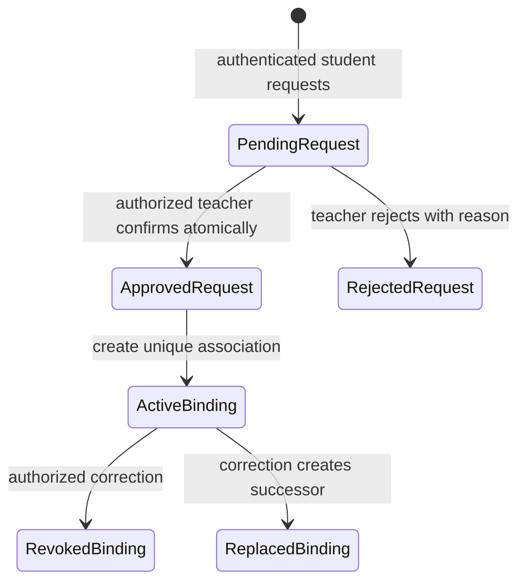
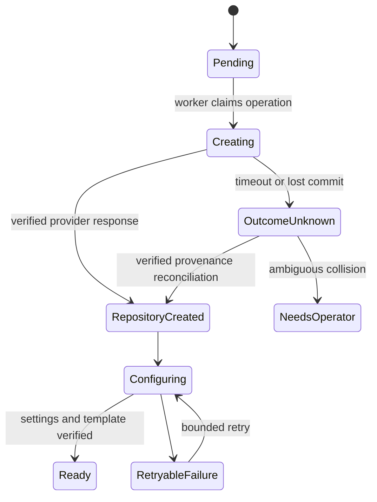
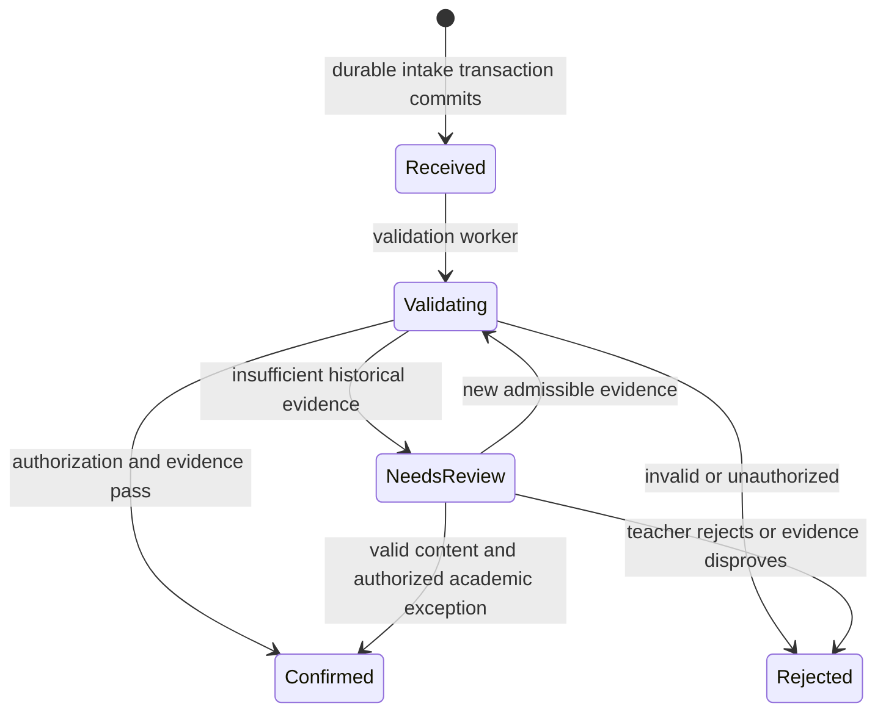
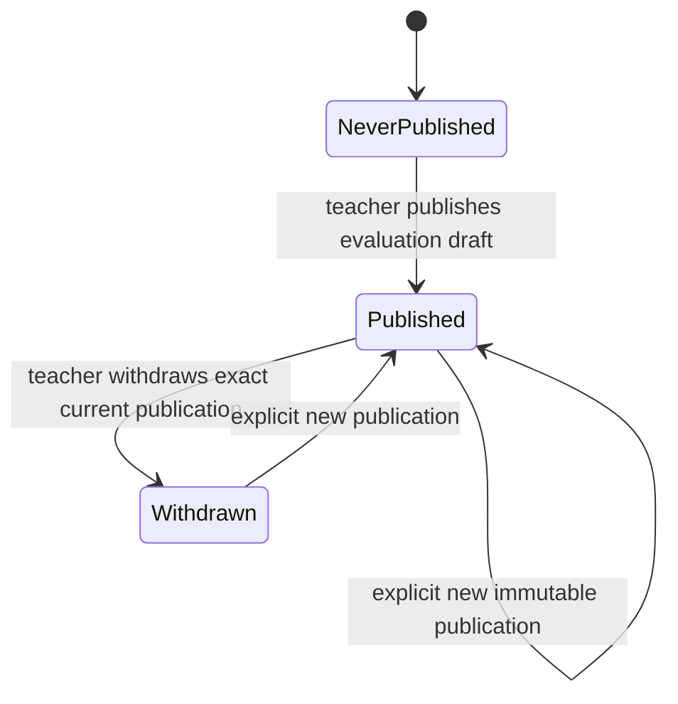
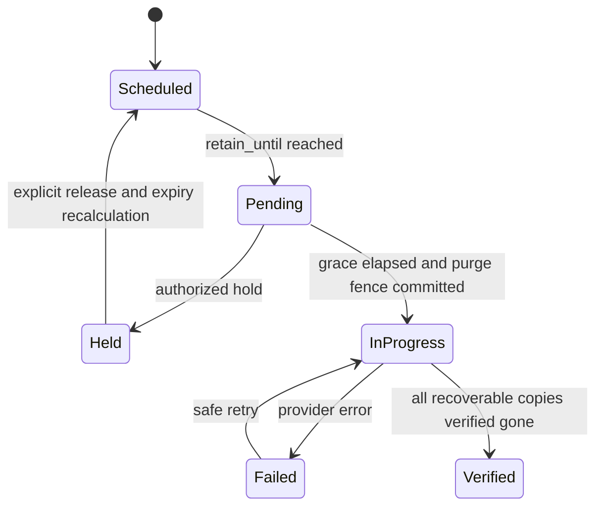

# State machines and user journeys

Lifecycle labels below are RECOMMENDATION. Semantics from AD-1–AD-11 are binding. Transitions run through application commands, never arbitrary state PATCH. Every mutation checks tenant, role, expected version and invariants. System transitions identify operation and causation IDs in audit.

## Orthogonal axes

Diagrams use readable labels; canonical serialized values are lowercase snake_case in OpenAPI. Received maps to received, NeedsReview to needs_review, RepositoryCreated to repository_created and NeverPublished to never_published. Published/Withdrawn describe the current-grade projection, not mutation of publication records.

| Aggregate | Separate axes |
| --- | --- |
| Course | draft/active/archived presentation; explicit academic_closed_at event |
| Acceptance | accepted/withdrawn academic membership; repository provisioning; access readiness; sync health |
| Submission request | receipt persisted; validation lifecycle; independent academic classification |
| Confirmed submission | immutable revision; independent preservation state; evaluation references |
| Grade | draft completeness; current publication pointer; immutable publication/withdrawal history |
| Snapshot | capture availability; completeness manifest; retention eligibility; physical deletion lifecycle |

## Identity

Request and binding are separate rows; arrows do not mean a single overloaded state field. Rejected request creates no binding. Concurrent approval conflicts, not last-writer-wins. Correction immediately blocks old academic authorization and separately starts GitHub permissions reconciliation. Neither teacher UI nor requester response enumerates someone else's account/claim details. The student enters their academic identifier; server response is non-enumerating and the teacher sees matching candidates in their authorized roster.

## Provisioning and access

Access axis: `not_requested -> invitation_pending -> granted`; revocation is `revocation_pending -> revoked`, with `blocked` for policy/failure. A repository can be provisioned while student invitation is pending. Integration health is `fresh/stale/inaccessible/installation_suspended`. A 404 is inaccessible, not proven deletion. No automatic destruction to compensate for a permission/configuration failure.

## Request intake and confirmation

`Confirmed` creates exactly one Submission and preservation intent. Teacher exception cannot turn an unauthorized actor or nonexistent SHA into valid evidence; it can recognize academic timing/eligibility exceptions with reason after valid content/identity is established. A rejected request is final for that operation; new SHA/new intent requires a new idempotency key. Retry of a completed operation returns original receipt; current status is a separate GET.

Academic classification is derived from immutable receipt plus an append-only resolution: `unresolved`, `on_time`, `late`, `exempt`, `not_applicable`. While validation is pending the UI may say "Received before deadline; verification pending", never "Confirmed on time". Missing deadline maps to not_applicable. A later extension does not rewrite receipt; teacher explicitly records reclassification. No Actions result blocks submission confirmation.

Temporal evidence rule: record a backend-observed exact commit/branch eligibility observation before or at intake. Preview returns a server-bound observation reference. At confirmation validate the request matches observation, installation/repo, actor binding and published branch policy. An observation after receipt alone cannot prove pre-receipt availability. Pre-receipt observation proves existence when observed, not continuous branch membership: MVP proposed eligibility is "observed on configured branch at preview, within a five-minute preview TTL", not "still branch head at receipt". TTL expiration or unavailable evidence gives needs_review; no inference from commit timestamps. Force-push after a valid preview cannot silently select a different SHA. Five minutes is a configurable recommendation, not a user-approved rule.

## Evaluation and official grade

Draft state is `incomplete/ready`, independent of the current grade. Submission R3 never retargets evaluation/draft/publication for R2. `newer_submission_exists` is an independent derived indicator, not a grade state. Evaluation completion never publishes. Student views show current grade and its revision; administrative notes never enter the student projection. Withdrawal requires student-safe reason and optional internal notes; replacement uses CAS, and concurrent withdrawal of old A after new B returns conflict.

## Capture and deletion

Capture: `pending -> capturing -> available`; errors go to `retryable_failure`, `blocked_by_quota`, `blocked_by_size`, `blocked_by_structure` or `source_unavailable`. An available archive can be `complete_for_declared_scope` or `partial`; explicit manifest lists excluded LFS objects, submodules, dependencies and external URLs. Deterministic failures do not loop automatically. Confirmation remains unchanged.

Before claiming purge, lock snapshot, inspect holds and latest publication, write tombstone and fence. After destructive request starts, new hold/publication cannot pretend to undo destruction: return a conflict, explain in-progress state and escalate to operator. Tombstone is replicated to an independently restorable journal before deleting bytes. A successful primary delete alone is not Verified if versions/backups can recover content.

## Core user journeys

| Actor | Journey and meaningful states |
| --- | --- |
| Institution admin | Authenticate; connect verified installation; run capability checks; see actionable blocked policies; authorize course staff |
| Teacher | Create course; CSV preview/errors; commit roster; approve identity requests; publish versioned assignment; capacity warning and invitation |
| Student | Login; request academic link without browsing roster; pending/rejected explanation; accept only after binding; track repo creation and GitHub invitation; work in IDE |
| Student submission | Preview exact SHA/deadline; persist request; receipt and validation status; confirmed revision or needs_review; independent capture state; results by SHA |
| Teacher/TA | Filter assignment table; select exact revision; inspect formative results; prepare evaluation/draft; teacher publishes; row shows newer revision separately |
| Teacher withdrawal | Confirm exact current publication and student-safe reason; conflict if changed; history retained; new publication later |
| Admin evidence | View quotas and blocked captures; adjust configured capacity with audit; hold/release; explicit academic close; review pending purge |

Every view includes loading, empty, processing, retrying, partial, unauthorized and unavailable states where applicable. Backend errors provide stable codes and safe text. Keyboard operation, visible focus, semantic forms/tables, status announcements and mobile alternatives to wide tables are acceptance criteria. WCAG 2.2 AA is a recommended test target, not a certification claim. Screens: public landing/login/privacy/terms; course/staff/roster; teacher assignment dashboard and evaluation; student assignments/submission/results/history; minimal institution integration/audit/storage admin. Teams screen is not shipped in MVP.
